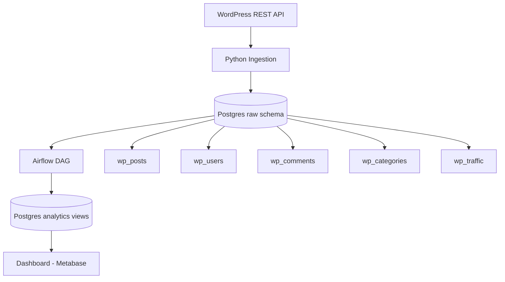

# WordPress Analytics Pipeline Architecture

## Included Data Domains
- Posts
- Users
- Comments
- Traffic
- Categories

## Runtime Components
- Python loader: [etl/load_wordpress_data.py](etl/load_wordpress_data.py)
- Postgres schemas and tables: [sql/init/001_init.sql](sql/init/001_init.sql)
- Airflow orchestration: [airflow/dags/wordpress_pipeline_dag.py](airflow/dags/wordpress_pipeline_dag.py)
- Analytics view builder: [etl/build_analytics_views.py](etl/build_analytics_views.py)
- Dashboard layer: Metabase connected to analytics views
